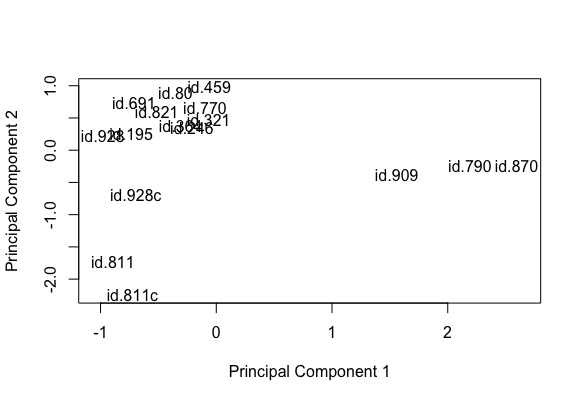
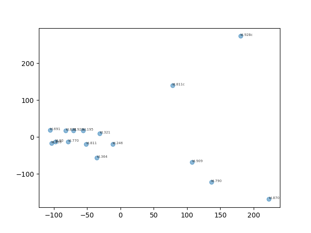
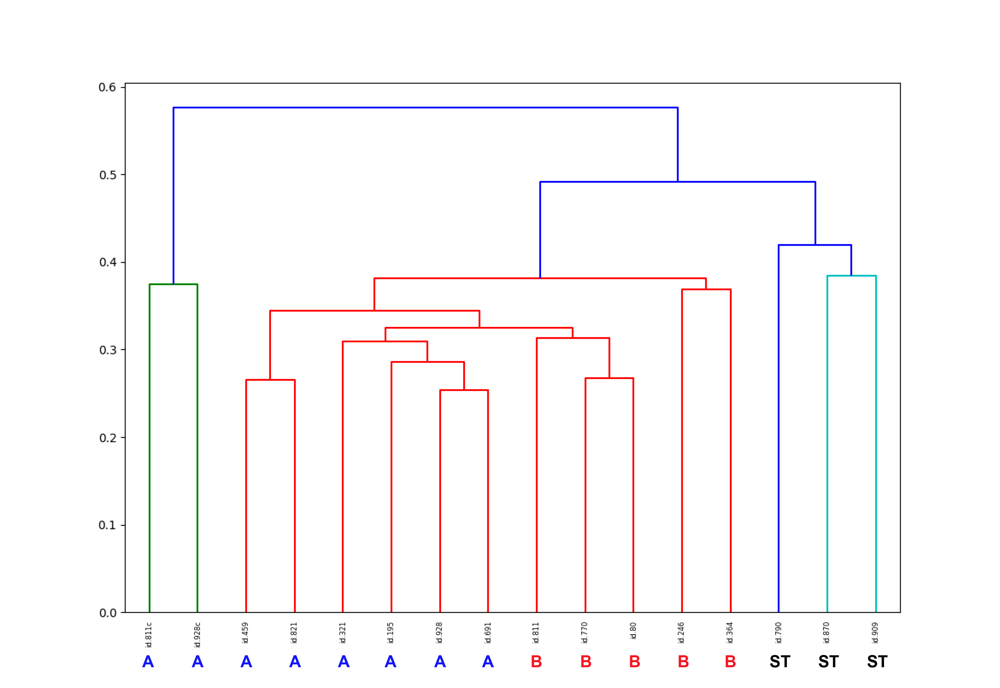

 

#### Purpose

The purpose of this project is to determine if data resulting from an 850K Illumina methylation array of ependymoma samples can be used to reliably predict ependymoma classifications via unsupervised clustering algorithms.

#### Importing raw data
Illumina 850K .idat files were obtained for ependymoma cell lines.  Annotation and principle component plots (for the top 1000 genes) was performed in R using methods adapted from a [manuscript by Pidsley and colleagues on preprocessing Illumina 450K methylation data.][1]

[1]:https://bmcgenomics.biomedcentral.com/articles/10.1186/1471-2164-14-293

#### PCA, K-Means, and linkage processing
Raw data was then extracted and processed using the python sci-kit learn package to perform clustering on the sixteen samples.  Raw data values were scaled using a 0-1 scale to represent the binary nature of the methylation data.  Principle component analysis was performed to reduced dimensionality to 3 dimensions, and K-means clustering was performed giving the following plot.

In addition this dendrogram was also generated.

From these results it appears that supratentorial ependymoma and ependymoma cell lines are classified independently from patient derived ependymoma samples.
